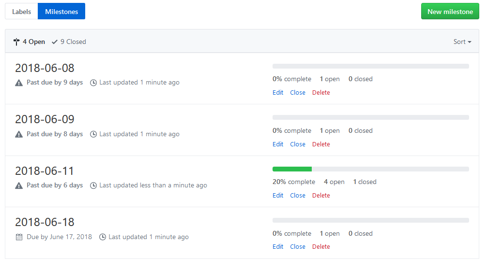

<!-- Generated with "Markdown T​O​C" extension for Visual Studio Code -->
<!-- TOC anchorMode:github.com -->

- [Introduction](#introduction)
- [TODO: Whine less?](#todo-whine-less)
- [General Philosophy](#general-philosophy)
- [Why Todoist?](#why-todoist)
- [Functional Requirements](#functional-requirements)
    - [Synchronization](#synchronization)
        - ["One-Time" sync](#one-time-sync)
        - [Sync changes from Todoist](#sync-changes-from-todoist)
            - [Sync Deletions](#sync-deletions)
        - [Bi-directional sync](#bi-directional-sync)
- [Data Mapping](#data-mapping)
    - [Todoist User Experience](#todoist-user-experience)
    - [Mechanisms Available in GitHub Issues](#mechanisms-available-in-github-issues)
        - [Issues](#issues)
        - [Milestones](#milestones)
        - [Projects](#projects)
        - [Labels](#labels)
    - [Creating the Mapping](#creating-the-mapping)
        - ["Label View"](#label-view)
        - ["Priority View"](#priority-view)
        - ["Due Date View"](#due-date-view)
            - [Milestone per Due Date](#milestone-per-due-date)
            - [Milestone per Issue](#milestone-per-issue)
            - [Milestone Problem](#milestone-problem)
        - ["Project View"](#project-view)
            - [Projects as Projects](#projects-as-projects)
            - [Milestones as Projects](#milestones-as-projects)
    - [Other Data Mapping Decisions](#other-data-mapping-decisions)
    - [Sharing](#sharing)
- [Idempotency in `import_from_todoist`](#idempotency-in-import_from_todoist)
- [Scaling](#scaling)
    - [Paging](#paging)
    - [Parallelism](#parallelism)
    - [Rate Limiting](#rate-limiting)
- [Security](#security)
    - [Threat Model](#threat-model)
        - [Untrusted Input](#untrusted-input)
        - [Open source](#open-source)
    - [Confidentiality](#confidentiality)
    - [Privacy](#privacy)
    - [Integrity](#integrity)
        - [Impersonation](#impersonation)
    - [Availability](#availability)
- [Licensing](#licensing)
- [Next Steps](#next-steps)

<!-- /TOC -->

# Introduction

Hello, I'm [Michael Overmeyer](https://movermeyer.com) (@movermeyer).

This page will discuss some of the decisions I made during the development of `import_from_todoist`. 
It will be written as a first-person, post-hoc narrative of the project, but you should be able to use the Table of Contents to jump to areas that are interesting to you without feeling too lost.

# TODO: Whine less?
When reading this, it will be important to remember two things:

1. This project was written for a take-home assignment as part of the interview process for a position at GitHub.
    * ie. Time was limited (1.5 weeks, part-time).
1. This was my first-ever Ruby code.
    * ie. I had a LOT of learning to do.
    
Both of these aspects factor into nearly every decision made during the project.

At times I will discuss what could be done in future iterations of `import_from_todoist`, since there was not enough time to do everything. A summary of these can be found in [Next Steps](next_steps.md). 

# General Philosophy

TODO: Consider removing.

When developing software, there is so much more to consider than just the functional requirements.
`import_from_todoist` was no exception. While the original [problem statement](problem_statement.md) was fairly simple and flexible, there were a lot of implicit requirements to satisfy.

Time was limited, so I had to prioritize:

1. Make it Work.
1. Make it Right.
1. Make it Fast.

I decided that my first concern was learning enough Ruby to get something working, leaning heavily on my existing expertise in Python. 
Simultaneously, I would try to learn the idiomatic way to do things in Ruby, and refactor as I went.
Once the functionality was largely in place, I would refactor to clean up code smells.
Then I would refactor the project to further improve usability. This would include a documentation pass to make sure that all existing functionality would be captured in the docs.

As discussed in [Next Steps](next_steps.md), there is still a lot that could be improved.

# Why Todoist?

The problem statement only required that I create a utility that can import from __some__ To-Do application. Why did I choose Todoist?

It made sense to choose Todoist since:

1. I had been using Todoist for several years.
    * This meant that I had an understanding of their data model and what I expected from it as a user.
        * This would help me make the initial usability decisions of the project.
1. I knew of their API.
    * I had seen a "Hello World" app that pulled tasks from their API, but had no experience using it personally.
1. I knew others who used Todoist.
    * This would allow me to potentially trial the system with them

# Functional Requirements

The original [problem statement](problem_statement.md) was fairly simple and open to interpretation. This left a lot of design decisions to make (which is part of why problems like this make for good interview questions).

## Synchronization

The first big decision of the project was that of synchronization: What level of synchronization was I aiming for?:

* ["One-time" sync](#one-time-sync)
* [Sync changes from Todoist](#sync-changes-from-todoist)
    * [Sync Deletions](#sync-deletions)
* [Bi-directional sync](#bi-directional-sync)

I decided to implement the second option in `import_from_todoist`, and if given more time would have implemented deletion synchronization as an optional flag.
(You can read more about the implementation of [idempotency in `import_from_todoist` here](#idempotency-in-import-from-todoist)) 

### "One-Time" sync
I could have made it a "one-time" import script. A user would run it once to migrate their Todoist Tasks to GitHub Issues. 
Then they would stop using Todoist and only use GitHub Issues from then on.
Realistically, these "one-time" scripts are almost never an acceptable solution, as the real-world use of software demands more than "one time" use.

### Sync changes from Todoist

Even if a user intends to use only GitHub Issues in the long-term, the user will often have a transition period where they are still using Todoist.
They will still be treating Todoist as the [source of truth](https://en.wikipedia.org/wiki/Single_source_of_truth), but will want a utility they can use to periodically sync the state in Todoist to GitHub Issues, in preparation for the move to only using GitHub Issues.

Perhaps the user actually has no intentions of giving up Todoist (it is a pretty good To-Do App), and just want GitHub synchronization for other purposes (perhaps as a "hot backup" in case of a potential Todoist bankruptcy). In this case, the usage is the same.

#### Sync Deletions

Sometimes the user will want to sync deletions within Todoist to GitHub. This allows GitHub to always be a faithful representation of the state in Todoist. At that point, GitHub is effectively just a presentation layer for the data stored in Todoist, as any changes made to the data in GitHub would be overwritten during the next sync.

Or perhaps some changes within GitHub would be acceptable, and persist in GitHub even after future sync events.

### Bi-directional sync

At the most extreme, you could say that all changes to data within GitHub should also be replicated back to Todoist. This is a bi-directional sync of changes. Bi-directional syncs can get very complicated, as you then have to be able to:
* detect changes in two systems (not just one)
* Design a bi-directional mapping that works with the lowest-common-denominator system.
    * ex. GitHub allows issues to have multiple projects, but Todoist tasks can only have a single project. How do you handle the case where a user adds multiple projects to an issue? You could arbitrarily pick one to sync to Todoist, but what if you pick "wrong", or unstably?
* Figure out how to resolve conflicts (where different changes were made to the same object on both sides)

# Data Mapping

## Todoist User Experience

(For a more thorough examination of all Todoist has to offer, and the mapping of data to GitHub, see [data_mapping.md](data_mapping.md))

Before designing the data mapping between Todoist and GitHub, I thought about how I wanted the final user experience to be.

I began my investigations by looking at the user experience of Todoist, and then looked to see which mechanisms GitHub Issues offered that I could hi-jack to offer a similar user experience.

In Todoist, the central concept is a **Task**. Tasks are your checklist items, usually:

* goals want to accomplish (ex. run a marathon, complete [Duolingo](https://www.duolingo.com/) exercises)
* things you want to buy (ex. milk, cereal, a tent)
* activities on dates you want to remember (ex. [Escape Room](http://questroomsf.com/) on August 5th)

Tasks are what I will be importing into GitHub as Issues.

In Todoist, when you complete a task, the task disappears from your view. You can still view the completed tasks in a separate "Completed Tasks" view. In my experience, it is very rare that I've ever gone and looked at "Completed Tasks".

Todoist has a few different ways to organize and view your tasks:

1. "Project View": You can group tasks into Projects, and then view your tasks by Project
1. "Label View": You can apply labels (ie, tags) to tasks, and then view your tasks by Label
1. "Priority View": You can apply priorities (1-4, with 1 = "Very Urgent", 4 = "Normal urgency"), and then view your tasks by Priority
1. "Due Date View": You can apply due dates to tasks, and then view your tasks sorted by due date

Given my experience using Todoist, I felt that these 4 ways of organizing and viewing tasks are the core of functionality of Todoist. These were what I was hoping to replicate after importing the tasks into GitHub. Of course, there is a [lot more to Todoist](data_mapping.md), but if I could accomplish that, then I felt that I would have succeeded.

I confirmed this list of core functionality by [interviewing another user](https://www.interaction-design.org/literature/article/how-to-conduct-user-interviews) of Todoist about how they use the software, as well as reading [Todoist's documentation](https://todoist.com/guide/getting-started) and seeing that they also focus on this set of functionality. 

(TODO: Talk about looking for examples of people using GitHub as a To-Do App?)

This could hardly be considered a rigorous user study, but it confirmed that having this functionality might make GitHub Issues a viable method of issue tracking.

## Mechanisms Available in GitHub Issues

My target audience for `import_from_todoist` was Todoist users who are looking to migrate to a similar experience within GitHub Issues. My primary goal was to create an experience they would find familiar, while keeping a long-term view that they would eventually transition away from Todoist. This meant that it was also important to consider the best practices around GitHub Issues' use, and not build too many `import_from_todoist`-specific features on top of it.

### Issues

In GitHub Issues, the central concept is an **Issue**. Different software projects use them for different purposes, 

(TODO: Write more about how they are used)

In my case Issues would fill the role of Todoist Tasks.

### Milestones

Issues could be assigned to **Milestones**. This offered a view of a list of items that was, at first blush, very similar to Todoist's "Project View".

(TODO: Write more about how they are used)

Most importantly, Milestones were the only concept that offered any native concept of due date. 

### Projects

Projects are another way to organize Issues in GitHub. They were designed in the style of [Kanban boards](https://leankit.com/learn/kanban/kanban-board//), with **cards** placed within **columns**. Cards could either be references to Issues, or be simple notes.

Projects could [be configured](https://help.github.com/articles/configuring-automation-for-project-boards/) so that as Issues were closed, the corresponding card would be automatically moved to a specified column. 

Projects can reference issues from multiple repositories, allowing users to track progress at a higher level than the individual repository.

### Labels

[**Labels**](https://help.github.com/articles/about-labels/) in GitHub were often used in a very similar way to Todoist Labels. They could be applied to Issues, and then a user could view all Issues with a specific label easily.

## Creating the Mapping

Issues were the obvious parallel to Todoist Tasks. While I did not take this for granted, it did not take much examination of the problem to convince myself that this was a reasonable choice. From there, it was a matter of implementing the 4 views.

### "Label View"

Todoist Labels could be mapped fairly directly to GitHub Issue Labels. 
The existing `/issues` page of each GitHub Repo allows users to filter by Label(s). 
Together this implemented the same functionality as Todoist's "Label View" 

### "Priority View"

GitHub has no native idea of "Priority". I had seen [projects use Labels](https://github.com/ansible/ansible/issues?q=label%3AP1+is%3Aclosed) with names similar to "Priority 1" before.

I decided to convert the Todoist priorities to GitHub Issues Labels. The existing `/issues` page of each GitHub Repo allows users to filter by Label(s). 
Together this implemented nearly the same functionality as Todoist's "Priority View".

The downsides of this method were:
* You cannot sort Issues by Priority, like you could in Todoist.
* Label names and Priority names could collide
    * This seemed like a very niche problem to have. What would a user be using the "Priority 1" label for that wasn't the same as the Priority use case?

### "Due Date View"

The trickiest of the views to model was the "Due Date View". This was a result of GitHub not having great native support for due dates. Issues themselves cannot be assigned due dates. This is probably a good thing as software projects can get bogged down by managing due dates without providing value. But in Todoist, due dates were first-class, and seeing which Tasks are due soon (or over-due) was an important piece of functionality.

The only mechanism within GitHub Issues with a concept of due date was the Milestones mechanism.
Further, Milestone due dates were limited to a granularity of 1 day, while Todoist had sub-day due "dates" (ex. "2018-06-10T18:00:00Z").

Two ideas for how to implement the "Due Date View" came to mind:

* Creating a [Milestone per due date](#milestone-per-due-date)
* Creating a [Milestone per Issue](#milestone-per-issue)

In the end, I chose chose the latter option. `import_from_todoist` models due dates by using a milestone per issue.

#### Milestone per Due Date
The first idea was to have `import_from_todoist` create a milestone for each due date. Then it would associate each of the issues with the corresponding milestone based on that due date.

Benefits with this approach:
* At the '/milestones' endpoint, GitHub showed the total count of issues for each day, which could be useful to see upcoming busy days.

Problems with this approach:
* At the '/milestones' endpoint, GitHub just displays a list of dates. Users have to specifically click on each day to see the specific Issues for the day.

* Ideally, the date displayed as the milestone title would match the user's timezone. However, since the title is static, this will not always be the case. You could simply use the UTC date, but that is not a great user experience. You could use the timezone of the user who imported the tasks, but then other users with access to the repo would not have a good experience.

#### Milestone per Issue
An alternative approach is to create a milestone for every issue that has a due date, and then associate the two objects.

Benefits of this approach:
* The individual Issue descriptions are immediately visible.
* Milestones are sortable by due date, giving you a list of upcoming issues/tasks to complete.

Problems with this approach:
* The '/milestones' endpoint becomes cluttered with milestones. Other views could not easily make use of the milestone functionality. Practically, this meant that I would not want to use milestones to also represent Todoist Projects. This was important when I had to decide how to implement the ["Project View"](#project-view). 

#### Milestone Problem

Without native support for Issue due dates, any solution I developed would tie the user to the `import_from_todoist` utility.
If the user ever decided to use GitHub Issues as their primary To-Do App, they would have to use GitHub's native functionality exclusively. 
Without `import_from_todoist`, they would have to create the milestones manually and create any associations that they wanted. 

### "Project View"

I ended up choosing to model Todoist Projects as GitHub Projects. There were two competing models that I considered: 

* Creating a [GitHub Project per Todoist Project](#projects-as-projects)
* Creating a [GitHub Milestone per Todoist Project](#milestones-as-projects)

I was leaning towards using Milestones, until my choice of using Milestones for ["Due Date View"](#due-date-view) made this impractical.
`import_from_todoist` imports each Todoist Project into a unique GitHub Project.

#### Projects as Projects

The obvious candidate for representing a Todoist Project in GitHub was the similarly named Project.
Both could hold lists of Tasks/Issues.

There were a few differences to note:

| Difference       | Todoist Project                                                               | GitHub Project                              |
| ---------------- | ----------------------------------------------------------------------------- | ------------------------------------------- |
| Ordering         | Arbitrary, user-defined order, or sorted by Priority/Due date/Name/Assignee   | Arbitrary or user-defined order. No sorting |
| Task Completion  | Tasks disappear from view when completed                                      | Issues move to "Complete" column            |

Losing the ability to sort by these attributes was inevitable, as there wasn't any native mechanism in GitHub that would allow for implementing the sorting by arbitrary values. At least by using the `/issues` endpoint, users could still filter issues by many of these attributes.

Benefits of this approach:

* Todoist Projects can also have comments made on them. 
    * GitHub Projects could be made to accommodate these by adding a column called "Comments" and placing a note card for each comment there. 

Detriments of this approach:

* Completed Issues are still displayed "front and centre" on the Project page (`projects/<id>` endpoint)
* Not great screen real estate usage. Usually users only care about "To Do" column, but always see "Completed" and "Comments" columns too. 
    * No way to resize columns to fill the page / stress importance. No way to collapse or hide columns.

#### Milestones as Projects

I could have chosen Milestones to be the analogue to Todoist Projects.

| Difference       | Todoist Project                                                               | GitHub Milestone                            |
| ---------------- | ----------------------------------------------------------------------------- | ------------------------------------------- |
| Ordering         | Arbitrary, user-defined order, or sorted by Priority/Due date/Name/Assignee   | Arbitrary or user-defined order. No sorting |
| Task Completion  | Tasks disappear from view when completed                                      | Issues disappear from view when closed      |

This would have the advantage of looking more visually similar to Todoist Projects, as the Issues disappear from view when they are closed.

## Other Data Mapping Decisions

While the major data mapping decisions were the above, there were plenty of other small decisions made.
For a more thorough exploration of the mapping, see the [Data Mapping document](data_mapping.md).

(TODO: Anything here?)

## Sharing

# Idempotency in `import_from_todoist`

Having decided to implement `import_from_todoist` as a utility [that uses Todoist as a source of truth for syncing changes to GitHub Issues](#synchronization), it followed that idempotent processing was going to be a necessity.

Idempotency is one of the implicit requirements of any data processing / [ETL](https://en.wikipedia.org/wiki/Extract%2C_transform%2C_load) task.

Being idempotent is useful, not only for ease of development, but also for recovery from potential errors/crashes, power failures, and other processing interruptions.

It was also reasonable expect that a user might want to continue using the original To-Do App, either while they transition to GitHub Issues, or simply forevermore. 

Idempotence of the importer implies that you either:

* need to know which operations you've already done, so you don't do them again on a second run

OR

* Design all your operations to be idempotent. You can always redo all the operations (at the expense of runtime) and still be idempotent. 

Since [I thought that] the GitHub API didn't offer much in way of idempotent operations, I focused on the former strategy. I later learned that many of the operations offered by the GitHub API could be safely used (if you caught the errors returned). However, by that point, I had a system that worked to provide the needed idempotency.

For details, see [Associating objects across changes](https://github.com/movermeyer/ImportFromTodoist/blob/master/docs/data_mapping.md#associating-objects-across-changes).

# Scaling

`import_from_todoist` should have been designed to be able to scale to arbitrary numbers of Todoist projects and arbitrarily large numbers of GitHub Issues, with at worst linear slowdown.

Scaling is an area that wasn't implemented well in `import_from_todoist`. There are places within the codebase with unbounded caches.
 Further, the Todoist API

## Paging
## Parallelism

Eventually even linear slowdown gets too slow. So 

## Rate Limiting

# Security

Security is often modeled as [being formed of three pillars](https://security.blogoverflow.com/2012/08/confidentiality-integrity-availability-the-three-components-of-the-cia-triad/):

* Confidentiality
* Integrity
* Availability

## Threat Model

Evaluating potential threats to the security of a system can be done by defining a threat model.

Our threat model allows for:
* Malicious actors to attempt to inject inputs into `import_from_todoist`
* Malicious actors to know everything about the operation of `import_from_todoist`
    * One exception is key material (ex. API tokens)

Notably our threat model assumes:
* `import_from_todoist` is running on a trusted computing environment
    * The machine running `import_from_todoist` is not compromised, either physically or via software.
* Access to the Internet cannot be impeded by a malicious actor
(TODO: Perhaps reword these to be "Malicious actor cannot" for consistency)

### Untrusted Input
If malicious inputs are used by `import_from_todoist`, 

There are several sources of malicious input possible:

* The Todoist projects that `import_from_todoist` can be shared amongst many collaborators. 
    * Those contributors might be able to craft malicious Tasks, Comments, etc.
* The GitHub repo that `import_from_todoist` writes to could be shared amongst many collaborators.
    * Those contributors might be able to craft malicious Issue bodies, Comments, etc.
* Either Todoist or GitHub themselves could provide malicious data to `import_from_todoist` via their APIs.

All of `import_from_todoist`'s communication with third-parties is done via HTTPS, which typically enough to ensure confidentiality + integrity of communications.
But if something is able to break those guarantees (ex. corporate MitM firewall), then it could also be a source of untrusted input. 

This means the users other than the user running `import_from_todoist` could influence the inputs that `import_from_todoist` use.
`import_from_todoist` was not written with resilience against malicious input as a primary concern. It feels likely that there might be a way to craft malicious inputs that create exploits that impact on any of Confidentiality/Integrity/Availability.

### Open source

All of `import_from_todoist`'s code is open source, and is available for inspection. This can help users gain confidence that `import_from_todoist` is not malicious, and hopefully free from vulnerabilities.

However, installation of `import_from_todoist`'s dependencies might rely on closed-source, or vulnerable code.

## Confidentiality

## Privacy

A breach of privacy is a breach of confidentiality.

The names or contents of Todoist tasks/projects/comments might contain sensitive information. 
Further `import_from_todoist` will import the names of the collaborators who commented on tasks and projects.

Running `import_from_todoist` exposes the information to anyone who has access to the GitHub repo. 
In the case of importing into a public GitHub repo, this is the entire world.

It is not the responsibility of `import_from_todoist` to make sure that the user is not leaking sensitive information. 
However, `import_from_todoist` tries to prevent accidental leaks to public repos by default. 
To prevent this most dangerous case of leaking sensitive information, `import_from_todoist` requires the use of an `--allow-public` flag before it will import into a public GitHub repo.

## Integrity

### Impersonation

Since `import_from_todoist` has no mechanism to get permission to impersonate other collaborators, all comments that it imports from Todoist are made using the account associated to the GitHub token. However, the comments always contain a trailing sentence that mentions the original poster and the time of the original comment.

## Availability

As mentioned into the discussion of [Untrusted Input](#untrusted-input), there could be attacks on availability.

# Licensing

After [listening to](https://changelog.com/rfc/9) licensing lawyer Heather Meeker talk about the relative ease of changing licenses from copy-left to more permissive licences (as opposed to the other direction), I decided to start by licensing the code under [GNU GPL v3](https://choosealicense.com/licenses/gpl-3.0/). I'm open to re-licensing the code if there becomes a desire to have a more permissive license.

# Next Steps

Due to time constraints, I was unable to complete everything I had hoped to complete. 
See [next_steps.md](next_steps.md) for a discussion of what could be improved.